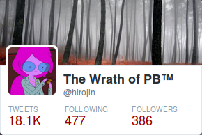

This talk runs under [Ed Finkler](http://funkatron.com/)'s Banner of [Open
Sourcing Mental Illness](http://funkatron.com/osmi.html), who has been running
these types of talks for over a year now. Ed talks very broadly on the subject,
while still backing it up with his personal stories.

I'd like to mirror his work under that banner: I'd like to talk about
depression, and addiction: Open source is work. Not just a work of passion, but
real actual work. And it can be taxing. I'd like to discuss how.

Content Warnings galore: The topics I discuss and the stories I tell can be
triggering. I am perfectly happy answering questions, but not everyone will
be comfortable asking. You can always seek me outside of this talk.

# Introductions

I'll start with some introductions…

## How I appear to be like everyone else (here)

* english speaking
* male
* white
* straight

## How I'm not quite like everyone else

* war refugee
* immigrant
* foreigner
* polyglot (Bosanski/српски/hrvatski, Deutsch, English, C, Ruby)
* dyslexic
* grew up in abusive home
* school drop-out
* alcoholic
* autodidact
* depression
* workaholic
* queer
* probably a twitter addict

## Why I'm telling you this

I could be telling you this for a number of reasons: first off, I could simply
be lying. This could be a fabrication. And one way or another it *is* a
manipulation: I could be trying to feed you subliminal messages about the
importance of diversity, in order to further my feminist, queer agenda. But,
actually, it's about making myself vulnerable, about opening up. This is an
extremely sensitive subject, so I will need you to trust me.

***This trust comes with a caveat:*** I am not a health-care specialist. All I'm
doing is sharing my own stories and experiences. What has worked for me, might
not work for you. All I can do for you is listen to your stories, but the only
real advice I'll be able to give is to ask you to seek help.

Let's get back on to my list: Many of those items can be "fixed", other things
are not for fixing but might need to be discovered and embraced.

I cannot go back and change the fact that as a child I had to flee my home
country, and along with other things in my history, it made me the person who I
am. I have "managed" my alcoholism in a simple, yet effective way: I quit.

This, however, is not so simple with other issues…

# Depression

I am constantly reminded of the fact that depression is a chronic illness, one
that can drastically shorten a person's life-expectancy. These reminders come
through the media and medical journals I read, and they come through personal
experiences.

Last week, [a friend of mine died](/articles/a-friend-died-last-night/)

I have read, and re-read these words many times since the night I wrote them,
and they remain painful.

There are no words from me that can fittingly describe the overpowering feeling
of nothingness, of one's own inadequacy, and the loneliness that makes up
depression. Better artists have already done that.

All I can contribute is this

> Depression lies, and when we listen to its lies, it kills.

I couldn't just quit depression. Which, ridiculously enough, is something that
people who don't know depression will demand. The same kind of people who will
happily ask me, every time, if I want a drink, while only listing alcohol.

There's a lesson here, and I'll come back to this subject later.

## Step One: Self-treatment

Having been a life-long autodidact, I was very eager to make a changes to "fix
my life". I would listen to advise from friends or even random strangers. I'd
take their advise on what bothered them about me, or I'd talk about something
that was bothering *me* about *myself*.

The pattern was always the same, and it's a well-documented in self-help books
that are not complete garbage, because it's extremely effective

* Identify an issue
* Find a set of solutions, and choose *one*
* Implement it, and stick with it for >=3 months
* Document, or observe changes
* Verify the result

Every single of one those steps is extremely hard.

It's well possible to train myself in a new habit of getting up an hour
earlier, or working out three times a week to run a marathon, or to learn a new
(programming) language. It's extremely hard, but it's possible.

It's a lot harder however, if I were in a depressive episode, and my brain
is lying to me.

* Every issue will be with me.
* Every solution will be that I somehow vanish from existence.
* Every attempt at sticking with a plan will be abandoned within days.
* Every observation will be warped.
* Every reflexion will conclude that the issue was with me to begin with, and
  that, yes, I must somehow vanish from this plane of existence.

And, none of this will help me identify that I do indeed have depression.
None of this *did* help me identify that. Sometimes you will need feedback from
the out-side world. Some people get that through friends or family, who rightly
recognize their issue, *and* have the courage to point it out. Maybe they even
point it out in a helpful way.

This whole process is made all the harder in that depression is *insulating* me
from the things that people are telling me, be that by overriding everything
they say with:

> They must be lying

Or, by directly *isolating* me from my friends.

My push past those lines of defense came through an eye-opening experience with
a former partner.

## Gauging your Limits

My then partner and I were together for about six months at that time, when she
left for long-planned month long vacation to south-east Asia.

She came back a "different woman." One she hadn't been in over ten years:
Anxiety and depression started to slowly seep in. They fed her insomnia. The
lack of sleep made her work as primary school teacher even more stressful.

The simplest of tasks such as printing a word document became infuriatingly
frustrating. Sending her into a fit of rage, or just sobbing and crying.

I *was* there for here; I'd work-out with her when she asked me to; I'd cook
with her, help her with her paintings; I'd hold her. But none of the help I
thought I could provide was enough.

She started researching suicide methods. There was nothing *I* could do.

All I could do was ask her to seek help. And help her get bootstrapped: Find
therapy. Find a psychiatrist. Make appointments.

I hit the cold hard wall of reality, and it made me realize: That was the limit
of my ability. It also made me realize that she was going through experiences that
were anything but new to me. She was experiencing it on a magnitude that I
never had. But that only helped to reinforce my own powerlessness.

There was nothing *I* could do, yet there was a support network ready to help her.

If there was help for her, then surely there was help for me too.

## Being Out In the Open

Three years ago, I had my ["coming out"](/articles/coming-out/). I'm *all*
about Open Source. I know the benefits of doing things in the open.

### With enough eyes, all bugs become shallow

If there's any message you take away from this talk, let it be that:

***No, This is not true.***[<a id="ref_1" href="#fn_1">1</a>]

Heck, it's not even true for Open Source, as OpenSSL has so thoroughly
demonstrated.

Even if my friends were actually medical health professionals, I couldn't
possibly expect help from them *directly*.

But there are other benefits from being out openly:

### It's much easier to create a support-network

The most important aspect of being out openly to my friends, means that my
friends already know. This means that when I need their help, or need them to
be more sensitive, or need more room, then I don't need to have *that
conversation*. We've already had it.

### When I fall behind on my goals…

…people can be there for me. They can remind me of those goals. Or they might
offer support, such as finding a new therapist.

I'd like to quote [Avery Edison](http://averyedison.com/) on the subject of
coming out, from her book, [Right Body, Wrong
Junk](http://averyedison.com/rightbodywrongjunk/)[<a id="ref_2"
href="#fn_2">2</a>]. Avery is a queer woman, and her book was on queer issues,
but the following commentary on her own writing still struck a chord with me:

> The fact that it's not a secret makes it all the easier to say. I still worry
> about how someone might react (there's always the possibility of a hidden
> bigot in the mix), but the whole process is easier. I don't feel like I'm
> unburdening myself, I just feel like I'm providing relevant info.

But, unlike coming out, which in my experience is not that big a deal anymore,
there's this giant stigma attached to mental illness, like all things that only
exist in the margins of society, so disclosing it is a delicate issue.

# Addiction

Let's talk about addiction then.

## Alcohol

In January 2012 I started working as freelancer, and for the first time I was
earning adequate amounts of money for my level of experience and the kind of
performance I was delivering. Which was *really* good, because after six months
of unemployment, of traveling, and, drinking, I had amassed around €20000 in
debts.

Those first two months, in which I worked my ass off, and, automated myself away,
had paid off my debt. But, I still hadn't quite learned any lesson at that point.
It took another six months of drinking, and "writing" (sitting in bars with a
notebook), until a police patrol picked me off my bike after a couple Guinness
too many. Once again, this was an external incentive, one for which, despite
the big price tag, I will be eternally grateful for.

It gave me *official* reason to pause, and reflect. Reflect on things I had
suspected were wrong for a long time. However, I had pushed them aside, as
being under my control, or important for my creativity, or that it's genetic,
or part of my charming personality.

I decided to quit. To literally never drink again, and that on its own was an
admission: I had admitted to myself that I was an addict. But that was just a
shaky start: Two weeks down the road, OSCon was going to be on, and I was deeply
afraid of what I knew was going to be obviously happening: An Open Source Event
meant it was guaranteed that beer and booze would be flowing in near infinite
amounts.

## Open Booze

Let's take a minute to talk about our tiny fragment of our culture here.
Fortunately I don't have to pull anything out of my ass, because the
outstanding [Kara Sowles](http://www.karasowles.com/) wrote a piece for [Model
View Culture's](https://modelviewculture.com/) [Events
issue](https://modelviewculture.com/issues/events) about [Alcohol and
Inclusivity: Planning Tech Events with Non-Alcoholic
Options](https://modelviewculture.com/pieces/alcohol-and-inclusivity-planning-tech-events-with-non-alcoholic-options).

To very, very, very briefly summarize what everyone should read:

* There are people who don't drink alcohol
* They don't have to give you a reason
* Events should provide them with drinking options

I am deeply indebted, to [Nóirín Plunkett](https://twitter.com/noirinp) for
standing up for me, and defending my decision before other OSCon participants,
who were about to ask the dreaded

> Why?

Nóirín's ferocity gave me the courage to stand up for myself and simply say:

> Because I'm an alcoholic.

> When I start, I don't stop. So I decided not to start.

In just a couple of days after quitting, I had learned how powerful the truth
about addiction can be. When it's simply pronounced like that, it left people
speechless. There is some dark irony behind the fact that I used to drink,
because I thought I am unable to talk to people otherwise[<a id="ref_3"
href="#fn_3">3</a>]. I was also afraid, that my not drinking would be the only
subject to talk about. Fortunately, that turned out not to be the case. And, at
the last conference party I was at (organized by Kara, no less!) I had someone
call me a

> Social Butterfly

But if you read [Kara's
article](https://modelviewculture.com/pieces/alcohol-and-inclusivity-planning-tech-events-with-non-alcoholic-options)
you may learn that this kind of openness isn't for everyone. It can be hard
enough to admit this to ourselves, or admitting it to friends and family, but
imagine how hard it is then to admit it to all kinds of strangers, over, and
over, and over, and over again.

This is again a parallel to coming out as queer: Unless we have it tattooed
across our foreheads, queer people don't have their "coming out" once, we have
to come out over, and over, and over again to new friends, new colleagues, or
potential love interests. As you can guess, some of those coming outs are
easier than others…

## Let's talk about work

For the longest part of my life, my work has been a core part of my
identity.[<a id="ref_4" href="#fn_4">4</a>]

> Šta radiš, Igo?

> Radim.

If I hadn't been really, really bad at sucking up to authority, I might have
made it all the way through school and into university, and might now be an
ACADEMIC.

<blockquote class="twitter-tweet" lang="en">
maybe i am, without knowing it,
an academic(!!!).
&mdash; The Wrath of PB™ (@hirojin)
<a href="https://twitter.com/hirojin/status/521506926916825088">October 13,
2014</a></blockquote> 

But even so, I am doing something (for money), that I absolutely enjoy.

<blockquote class="twitter-tweet" lang="en">
i should start using twitter for
time keeping: ✶ complaining about meetings → meeting ✶ complaining
about rspec / puppet → &quot;open source&quot;  ✶ complaining about haskell
/ python / java / puppet / configuration formats → ~paid work~ ✶
complaining about debuntu / ipv6 → <a href="https://twitter.com/brainsware">@brainsware</a> 
✶ praising a piece of technology: I PROBABLY HAVEN&#39;T ACTUALLY WORKED WITH
THIS DISREGARD MY OPINION.
&mdash; The Wrath of PB™ (@hirojin) <a href="https://twitter.com/hirojin/status/527112045188354049">October 28,
2014</a></blockquote> 

Except, when I don't. Make money for it, I mean.

### A Show of Hands

* Who here does no Open Source Work at all?
* Who here lives 100% off their Open Source work?
* 50ish%?
* Who here would starve if all they did was Open Source?

[TODO: Update the above list with the actual results]

For a number of personal reasons, I fall into that last category.
We'll come back to this eventually, but first I'd like to about my

## First Burn Out

When I was 21, I had my first, full-blown burn out. Seven years later, I would
[write](/articles/random-facts-about-me/)

> The first time I had a burn out while still at school, at the age of 21. It
> was essentially three months of me not leaving the bed.

Of course, that's not true. Almost a decade later, I would ask my mother about
the time-line, and it turns out it was more like a week or so. While *I'm bad
with time*, not even I am *that* bad with time.

> Time is an illusion. Lunch-time doubly so.

In its [final
stages](https://en.wikipedia.org/wiki/Burnout_%28psychology%29#Phases), burnout
can cause a full-blown depression. But the first step down-hill is

> Working Harder
>
> Because they have to prove themselves to others or try to fit in an
> organization that does not suit them, people establish high personal
> expectations.

I spent seven years in a five-year school, failing every odd grade. And yet,
even after having had a complete burn-out, I wanted to come back and finish it.
Only then, and, thanks to being employed and having slipped into a chronic lack
of time, I realized that school wasn't quite for me. Finally.

## Second Burn Out

I spent two years too long in a job I couldn't stand. The company had grown too
big, the management too deep. As Engineer, I was earning €30 more than when I
started as Junior. Except when I was on-call.

I stayed long hours at the office, staring blankly at the screen, or "doing
open source" (IRC, before there was GitHub and Twitter), until everyone had
left, so I could finally get some work done, when it was silent.

Often, even then, I couldn't really get anything done, because of course I
depended on my colleagues to do things for me. So all I'd do would be prepare
my work, and write passive aggressive emails or tickets. Then, cycle home super
late, sleep in long, lie half-asleep for two hours in bed, and get in super
late to work.

This turned out to be an unsustainable cycle[<a id="ref_5" href="#fn_5">5</a>]:
I quit my job.

Now, quitting your job is not always an option. Quitting work in general,
appears to be no option at all in our society. So, after a six month hiatus, I
finally became self-employed. And that changed things considerably for me:

First, I could set my own price. But more importantly, I am now only getting
paid for things I'm actually doing. There's no need to be present 40 hours a
week. When I'm unproductively staring at the screen, I'm not billing my clients,
and that is strangely liberating.[<a id="ref_6" href="#fn_6">6</a>]

And, as I have recently discovered that, when projects are piling up,
developers ~getting sick~, management being conspicuously vague or absent, I
can simply remove myself for a week.

I used to be proud of being able to work in a stressful environment. Now I'm
just really happy when I can work in one that's not toxic.

Which leads us right into the topic of Open Source.

# A Letter from a Hobbyist

I could probably count the jobs and projects I've gotten through my Open Source
work on one hand. I'm not a developer in the classical sense. And on the DevOps
continuum, I am definitely on the Ops side. For a long time I've seen Open
Source as a hobby. An intellectually slightly more challenging and thus
rewarding pursuit, than, say, reading comics.

However, [Open Source is
Work](http://www.ashedryden.com/blog/the-ethics-of-unpaid-labor-and-the-oss-community).

If Open Source is work, and if, for many people it's *unpaid* work, then it's
hard for it to be a hobby that provides an adequate counter-weight to your job.
It becomes another stressor. And we soon find ourselves trying to avoid it…

The problem isn't really the software we're working on…

<blockquote class="twitter-tweet" lang="en">
the short summary is that
software is suffering. the longer story is that software is suffering,
because people.
&mdash; The Wrath of PB™ (@hirojin) <a href="https://twitter.com/hirojin/status/532841838059986944">November 13,
2014</a></blockquote> 

## J. Random Hacker

A quick show of hands, who here has read esr's

* [Jargon File](http://www.catb.org/jargon/html/)?
* or [A Portrait of J. Random Hacker](http://www.catb.org/jargon/html/appendixb.html)

[TODO: Update with the above list with actual results]

If you haven't read the latter, I highly recommend to also compare it with the
WikiPedia on the [burnout
"roadmap"](https://en.wikipedia.org/wiki/Burnout_%28psychology%29#Phases)[<a id="ref_7" href="#fn_8">7</a>]

Probably the biggest disconnect with the rest of the text is visible from
[Weaknesses](http://www.catb.org/jargon/html/weaknesses.html) chapter.

> Hackers have relatively little ability to identify emotionally with other
> people. This may be because hackers generally aren't much like ‘other
> people’. Unsurprisingly, hackers also tend towards self-absorption,
> intellectual arrogance, and impatience with people and tasks perceived to be
> wasting their time.

I would posit that this portrait of J. Random Hacker was probably the most
toxic piece of writing that I could have absorbed while growing up and learning
to program. It validated all the things that lead me into burning up, and it
brushed aside all the things that I was uncomfortable with.

# Making a Change

I believe that our ~hacker culture~ is in urgent need of disruption. I am
convinced that it's so thoroughly toxic that we are going to work ourselves,
and the people who most depend on us, into a corner. For now, while we are
still the movers and the shakers of the world, we should perhaps stop and
consider how to wield that power responsibly.

## If you do not suffer from depression or addiction

I think the first and simplest thing that everyone can do is to be more
considerate of themselves, and of others.

[Leslie Hawthorn](https://twitter.com/lhawthorn) has held this very [short
keynote](https://www.youtube.com/watch?v=kWRCQYRZJzo) at OSCon this year, in
which she gives a very simple recipe for how to do that:

> Listen to people who are not like you.

## If you suffer from depression or addiction

I can only recommend you surround yourself with people who support you, not
just with people who *claim* they are supportive of you.

And, I implore you, seek help.

I am convinced that if everyone in this room today were to regularly see a
therapist, that the world would be a better place tomorrow.

Thank you.

# Resources

* [Ed Finkler's talks, slides and resources](http://funkatron.com/osmi.html)

* [International Mental Health First Aid Programs](https://mhfa.com.au/cms/international-mhfa-programs)

* In Austria there's [Projekt TIRAM](http://www.iam.or.at/tiram/), which among
  other things connects patients with therapists in training.

# Thanks

* [@kangarara](https://twitter.com/kangarara) for reviews and suggestions

-----

[1]: writing those lines was extremely hard. Just
writing it, despite its context, felt absolutely hypocritical, after recent
experiences with a friend dying. [↲](#ref_1)

[2]: I'm very thankful to @kangarara for pointing out
me that co-locating queer issues and mental health might make people associate
that queerness is a mental illness. If my words on the subject can't help
clarify that this is *not* what I mean, it's probably better to delete this
whole section in future revisions.[↲](#ref_2)

[3]: do I really have to point out how badly that
worked? [↲](#ref_3)

[4]: There is another 4000 word essay in that sentence,
that I didn't get to write last week, for reasons already mentioned…
[↲](#ref_4)

[5]: "unsustainable cycle is a euphemism: I was suicidal at that time. [↲](#ref_5)

[6]: There's this piece by [Quinn
Norton](https://twitter.com/quinnnorton), [Against
Productivity](https://medium.com/message/against-productivity-b19f56b67da6),
that I still haven't read… [↲](#ref_6)

[7]: thanks to David Schmitt for
[pointing](https://twitter.com/dev_el_ops/status/534228435556909057)
[out](https://twitter.com/dev_el_ops/status/534229556543385600) that connection
[↲](#ref_7)

[X]: TXT: more txt [↲](#ref_X)
