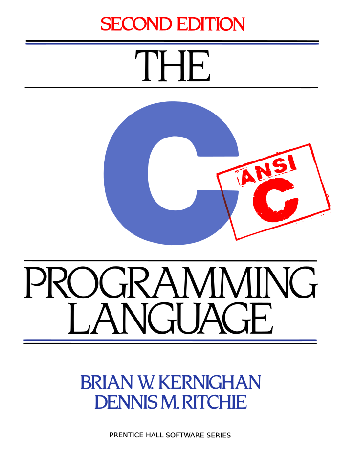
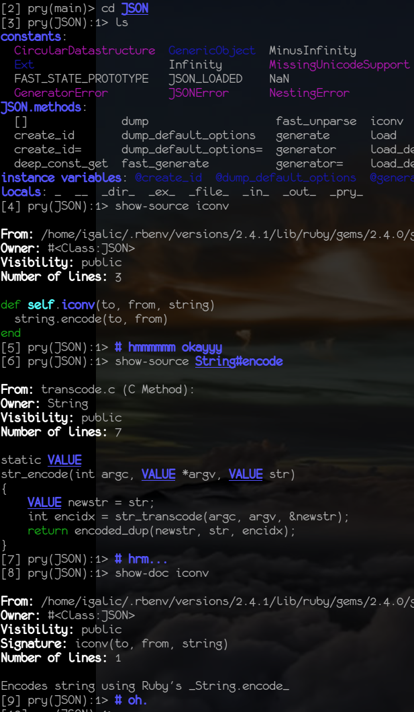

# Ops to Dev

This is the write-up of a talk first given a [DevOps London, 2017](https://www.devopsdays.org/events/2017-london/program/igor-galic/)

You can find [my slides](slides), and a [video recording of talk](video) in the appropriate venues.

## Abstract

As student Richard Feynman had an unorthodox approach to mathematics. Later he would frequently stun his famous and well established colleagues — simply by using tools from a different box.

We have very different tools — and methods in Dev & Ops. Much of DevOps has been to transfer methods and tools from Dev to Ops. But coming from Ops, I’d like to think that there are things Devs can learn from their Ops colleagues.

In this talk I’d like to talk about what Ops folk can bring to a Dev position, and what habits we best leave behind.

## whoami

My name is Igor, and I'm a co-founder of various open source projects (Vox Pupuli & FruitfulJS). I'm active (or, have been) on many more than that (Apache httpd & trafficserver), Puppet (modules), and recently, iocage.

I am also the cofounder of my company, where the general theme of Infrastructure & Open Source continues.

I am also ✨🌈queer✨🌈.

which, despite, or perhaps becaus of appearances I find important to mention:

- i am white
- male looking (passing?)
- english speaking

appearances aside, my first language was serbo-croatian,

I was a war refugee, I'm an alcoholic, I'm depressed, I'm bi-sexual, and I'm gender-queer. None of these things are important or really relevant to this talk, but they are to our community in general: Any attempt to at diversity is a mere lip-service if we don't reognize the people in our midst as who and what they are. The easiest way to do so, is to have prominent members of the community use the platforms they are given to represent the full spectrum of our community. And sometimes that can be as simple as saying who and what they are.

## Background (radiation)

For the longest time in my career, I would not have called myself a programmer.
I was a "system administrator", an "application engineer", a "systems engineer", a "devops engineer" *\* groan \**, etc…

A little bit of background: I am a classically trained Unix systems administrator.

That is, I went to school, and learned programming in C.
and then C++, Micro Assembler, 360 Assembler, PL/I, Java and PHP.
I finally gave up before learning COBOL and switched to the networking branch.

Now, **you** might look at this, and think, that looks like an awful lot of programming. Are you sure you weren't a develeloper already?

…And you might be right.
…And if it hadn't taken me 15 years to recognize this, we wouldn't be here for this talk.

And so my first job was an [SRE position](https://omniti.com/seeds/what-is-web-operations) (at at a time when it wasn't called that) in a Solaris shop.

## Ops tools

Here's a couple of tools I learned in my Ops jobs (and _how_ I learned them).

- How to [build a distro](http://www.linuxfromscratch.org/lfs/view/stable/)
  - How the Unix Runtime works
  - How to build Software
  - How to debug the runtime, a.k.a. `strace(1)`

- [How to install software](http://users.owt.com/lazrchet/humor/install.htm)
    - "Documentation"
    - Debugging (when all you want is sleep)
    - risk assessment
    - reading code of literally any language

- [Automation](https://blag.esotericsystems.at/articles/automation/)
  - make (I'm friggin serious)
    - idempotency (okay, Puppet might be better here;)
  - perl, bash, ruby
  - systems and more systems
  - read & comprehend docs
  - predict & control behaviour

- Support (IRC!)
  - debugging other people's problems with minimal (and completely obsucre) information
  - Patience (Thank you [Rich Bowen](https://twitter.com/rbowen))

- Design & Architecture
  - Explaining the same problems (& solutions) to the same developers every 3 - 6 months (patience is a very important skill)
  - Building & Debugging distributed "systems"

- [On Call](https://dbsmasher.com/2016/12/07/on-being-on-call/)
  - surviving on minimal sleep (bad for patience)
  - followed by maximum alcohol (I'm glad that a new generation of Ops folks is indulging in tea. This seems a much healthier option)

- NO (or: Fear & Loathing of the sleep deprived)
  - can we do…? No.
  - Can we get…? No.
  - We need… No.
  - … because, No.

## How I "became" a Developer

At some point in your life, or career, you might notice that you're writing more Ruby or Python than YAML.
Congratulations, you've now crossed the line and have become a developer.

<blockquote class="twitter-tweet">
I really like that Puppet&#39;s talking about code and development, not scripting (often a pejorative). <a href="https://t.co/EMSwIwxNc4">https://t.co/EMSwIwxNc4</a> /cc <a href="https://twitter.com/omrig">@omrig</a>
&mdash; Donnie Berkholz (@dberkholz) <a href="https://twitter.com/dberkholz/status/902164887496949760">August 28, 2017</a></blockquote>

I'm extremely proud to be part of this (however peripheral these days): Puppet has been pushing the limits of what it means to be a "DevOps Engineer". And yet, it's still somehow "complicated" — in my mind, anyway.

The many thousands of lines of C++ code I ~~wrote~~ deleted previously for an Open Source project didn't really count: I didn't get paid for that. And really, I was just mostly a release manager, and a documentation copy/paster.
And neither did the thousands of lines of Ruby and Puppet code count, because that was just infrastructure automtion, and infrastructure is, by default, invisible. I'm very glad Puppet happened to me. I got to know a lot of people who I consider dear friends, I co-started Voxpupuli, and Puppet & Ruby inspired me to learn a bunch of Functional Programming languages, expanding my horizons from Erlang to Common Lisp & Clojure, all the way to JavaScript.

So despite the fact that I wrote (or, deleted) a lot of code, I never considered myself a programmer, or a software engineer, or a coder (and I was long past romanticizing myself as hacker).

Then, one day this year, I told my boss (yes, self-employed contracters also have bosses), that I wasn't really sure I could be coming back next quarter. In fact, I might not be coming back next month. The new **full-time** (an attribute always greatly appreciated by managers) hire had a coöperation style which wasn't really appreciated by anyone who's actually had to work with him.
Instead of leaving, my boss askmed to transfer to a different team. That team was developing an infrastructure provisioning tool in Go.

And ***that's*** how I became a developer.

## Ops Tools in Dev

A few years ago, I wrote

<blockquote class="twitter-tweet" data-lang="en">
maintaining a million puppet modules has taught me one thing: not a single piece of software was written with automation in mind.
&mdash; igor💜Ⓐ☭ (@hirojin) <a href="https://twitter.com/hirojin/status/672033157391245314">December 2, 2015</a></blockquote>

which I then expanded into a blogpost of guidelines on what to do to make your [software easier to automate](https://blag.esotericsystems.at/articles/automation/)

- known "good" configuration format
  - and/or well behaved (idemptotent) configuration tool
- Packages
  - provide atomicity
  - version numbers that can be trusted
  - discoverable!
  - don't (accidentally) make [your own package manager](https://medium.com/@sdboyer/so-you-want-to-write-a-package-manager-4ae9c17d9527)
- using system services
  - no need to reinvent multiple wheels
  - just use your init system as watchdog
  - log rotation!
- Documentation
  - all of the above…
  - also error messages and log lines should be… useful

I have since (2015) learned a lot about configuration formats

<blockquote class="twitter-tweet" data-lang="en">
Any sufficiently complicated Go program contains an ad-hoc, informally-specified, bug-ridden, slow implementation of half of Lua.
&mdash; igor💜Ⓐ☭ (@hirojin) <a href="https://twitter.com/hirojin/status/903159370686582784">August 31, 2017</a></blockquote>

So… rather than inventing another wheel, maybe we should just start embedding well rounded wheels.

I realised this (possibility) only a few days ago yesterday myself, so don't worry if you don't have a [library for doing that](http://circonus-labs.github.io/libmtev/) yet…

------

One of the first things you can do as freshly minted programmer coming from ops land is to start advocating for all the things you've felt were missing!

If you're building a command line application, you could argue for better UI/UX — now, let's be honest, you could always argue for better UX, but CLI utilities are just criminally neglected in this regard. As is their documentation. And their log messages or their error handling.

If you're building a web application, you would want to bring in resillience.
Resilience could mean any number of things: Such as splitting the app along different lines (of concerns) so that crashes don't affect vital parts, or adding metrics to eventually figure out why it's crashing to begin with.

With your rich experience of running and debugging a million different daemons, you might help »accelerate« your ~~burnout~~ »burndown« chart, by writing less code. Entire modules someone planned, or even designed, and someone would need to write, can often be replaced with a single configuration option in an existing, well tested piece of software.

With your very different toolkit, you could *easily* aid in debugging complex issues, regardless of your (lack of) experience with the language in question.

It's a well worn (although not necessarily good) tradition, that the newest member on the team complete, or, often enough, simply, *write* the project's documentation. Personally, I've found one of the easiest ways to document code is to refactor it for simplicity. I will use any number of reasons (excuses) to push for this. One of my favourite being, I'm dyslexic. I might be disylexic, but making code easier to read benefits everyone.

Establish a support channel: Most Ops folks (I know) are very comfortable asking for help on 👻IRC👻 or other media. You may want to establish this kind of service for the software you're building as well. In $BigCo, we adopted the Admin of the Day concept for rotating the Support Person of the Day. And recently, a support-backup! for new team members!

## The (dreaded) Ops Process

Okay, what's so bad about the Ops Process, that we had to invent DevOps?

- 🐢 (all the way down)
- NO, because no.

In the before-time, before everything was automated and cloudified, ops was always there to you:

> No.

Ops was always risky job, and many of us have developed a habit of being risk-aware, or rather, risk-averse — to a fault.
This culminates in the habit of saying no to every new idea.

Let me dispel your fears today:

There are no new ideas.

(The Rust programming language is so named because while appearing relatively recently, none of the concepts it incorporates are. Most of the theory behind rust is at least 20 years old.)

## Fear of Inadequacy

I'm not going to talk about impostor syndrome. More competent folks have talked a lot more competently about this than I possibly could. */\* … \*/* But, in all seriousness, I'm not a very good programmer. This is something I have used as leverage, by arguing for refactoring barely readable code, but it's also something that's held me back for the longest time.

Despite ability to read and understand a piece of software, to point to a code-block that needs fixing, and sometimes even fixing it, this is "relatively easy". Even though this skill has given me an incredible edge compared to most of my co-workers, in my head I considered this a core skill that every Unix administrator had to have.

Understanding the software as a whole — enough to  add new features is an entirely different matter. Reading Code is hard. Reading code comprehensively is hard. Writing code is hard. Writing good code is harder still.

So let's talk about the (secret??)

## Missing Dev Tools

It turns out there's a number of things I've been missing, and worse yet — misunderstanding.

There wasn't really a FreeBSD manual equivalent for programming (that I was aware of): A manual that comprehensively explains general concepts of programming as clearly as the FreeBSD manual explains the concepts of Unix system administration.
Alternatively, a [Linux from Scratch](http://www.linuxfromscratch.org/lfs/view/stable/) equivalent would be incredibly helpful:

If we look deeper into the LFS book, it takes us from a blank slate to a usable Linux Distro through relentless repetition: At every checkpoint we either have a working base, or have to debug — using only the limited methods we have learned, and only the tools we have **built** so far. Failing that, we have to start over.

There are books that fit this bill. They are few and far in between. Most of all, they are **not** the classically recommended books

I'd like to point out two of my favourites:

- [Eloquent JavaScript](http://eloquentjavascript.net/), and
- [How to Design Programs (Second Edition)](http://www.ccs.neu.edu/home/matthias/HtDP2e/)

If you're not up-to-speed with programming at all yet and what to start out, then I can highly recommend the "For Kids" series of books.

- [JavaScript for Kids](https://www.nostarch.com/javascriptforkids)
- [Ruby Wizardry](https://www.nostarch.com/rubywizardry)

Sometimes we have to bite the bullet and learn a new paradigm, but often enough we can get away with using parallels for understanding or exploring. For me, one of the most powerful paradigms that I use **daily** is a REPL (read eval print loop).

I use [Fish](https://fishshell.com/) all day, and I suppose you use something similar. Now, first off: That's a REPL right there. But, what if I told you, that you could explore a programming language the same way you're exploring a (Unix) system?

Enter pry. Literally. Let's say you wanted to find out how `iconv` in Ruby's JSON module work…

To me, `pry` was a revelation. Once I found pry, I wanted every programming environment to have something like that! What actually happened, is that I would gravitate towards systems which had something like pry ;)

- Ruby: pry
- python: jupyter
- clojure: (clojure ;)
- erlang & Elixir: iex

A powerful REPL is a good sign of a good tooling ecosystem that will let you browse, explore and auto-complete source code. This might might represent a bit of a heretic departure from the classic Unix way of using just an editor, but, eh `¯\(°_o)/¯`. If you want to dig through 330 thousand lines of 17 years old C++ code, you will want to use any trick and cheat that exists out there.
Depending on your grasp of C++, 330KLoC could read like the first book of Game of Thrones (~298K words), or, like the entire series (1M 770k. thus far). But unlike GoT, you can't read Apache Traffic Server's code from start to finish. Where does it begin? Where does it end?? It's a mystery;)

So I lied. Obviously ;) There are good resources and good tools. Available, to make programming accessible. I want to call out two other books, which are very useful once you get far, far, far — and then get stuck!

- [Ruby under a Microscope](http://patshaughnessy.net/ruby-under-a-microscope), and
- [ERLANG IN ANGER](http://www.erlang-in-anger.com/)

## $€£¥.¢

Now that you're a successful (powerful) Developer, you may wanna renegotiate your salary. If you're not earning as much as your Dev colleagues, something's amiss…
Come to think of it, perhaps your Ops colleagues should renegotiate their contracts as well: After all, DevOps *is* the great equalizer.

## That's all Folks

From me, anyway! At this point, I'd like to welcome your questions, comments and anecdotes about your Journey (in either direction) and your experiences or fears.
