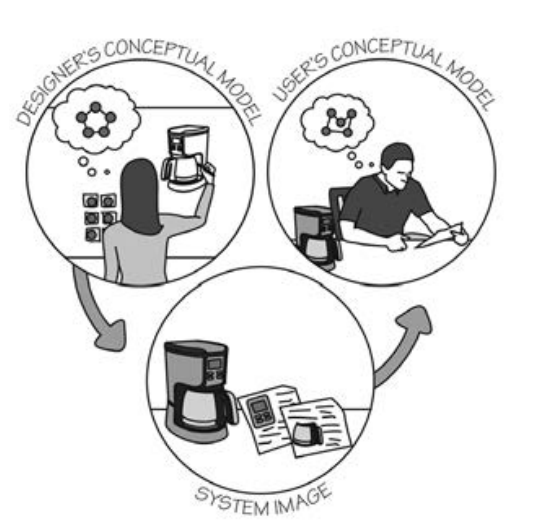

this is a write-up of my poorly prepared and poorly presented [talk at puppetconf 2014](http://sched.co/1kR57MI)

<span class="more"></span>

you can find the slides of this talk on [my speakerdeck](https://speakerdeck.com/igalic/absolute-beginners-guide-to-puppet-through-types). i'll also update this space with a link to the video as soon as it's published.

initially, no, long before that, the title of my talk was meant to be:

# Complete Beginners' Guide to Puppet - Through Types!

the idea was to teach complete beginners puppet, by showing them how it works from the very inside. types and providers are a natural start: they allow you to define your own resources, and after all, puppet is *all* about managing ***resources***.

during the course of my research, however, i realized that this might be a little bit naïve. working through puppet internals is daunting, at best.

# Guide to Puppet - Through Types!

as such, i decided to keep it short and sweet, AND: by the sheer luck of having gotten to know the authors of [Puppet Types & Providers](http://shop.oreilly.com/product/0636920026860.do), and being [friends](https://twitter.com/bkero) with one of the [new Pro Puppet](http://www.apress.com/9781430260400) i also had 6 types & providers books, and 2 pro puppet book to give out (as distractions), to anyone who asked or answered smart or silly questions. so this (talk|blog) assumes you are ***not*** a complete beginner, that you have gone through [puppet learning vm](http://puppetlabs.com/download-learning-vm), and know [how to compose (good) modules](https://puppetlabs.com/presentations/practical-guide-modules-lauren-rother-puppet-labs-morgan-haskel-puppet-labs).

## whoami

my name is Igor Galić (in the video you'll hear me pronouce this)

i'm igalic on github and irc (in the video, you'll hear me pronouce this)

and i'm @hirojin on twitter.

a word of warning if you're planning to follow me on twitter. i tweet, ***alot***. and this is my pinned tweet:

<blockquote class="twitter-tweet" lang="en">
<p>i gained new followers today.&#10;&#10;wonder how long until they notice that all i do is rant about computers, capitalism &amp; retweet feminists.</p>
&mdash; The Wrath of K&amp;R™ (@hirojin) <a href="https://twitter.com/hirojin/status/506865168480227328">September 2, 2014</a></blockquote>
<script async src="//platform.twitter.com/widgets.js" charset="utf-8"></script>

## how i got here

(🚗 ✈ 🚅 🚶)


i learned c, c++, (pic and ibm 360) assembler, java, pl/i at school.
i taught myself php, ruby, and started doing linux semi-professionally.
first job was what today we call "reliability engineer", deploy/debug jee apps on jboss running on solaris. we had automation. a self-grown solution written in java (for unix), and i wrote the underlying deployment scripts in bash.

early on i've been involved with open source. i'm an Apache Member, a comitter to httpd, Traffic Server. my next job was automation: and i used everything at my disposal to automate myself away: bash, make, ruby, perl
finally: i got a client that exclusively worked with puppet, and got into that, and ansible.

but really, the way i got here is by being curious about how things work.

[](https://www.flickr.com/photos/mskogly/3267064872)

like most of us, i like building things, or taking things apart, and maybe even, putting them back together.[[1](#fn_1)]

## why this talk exists

the main reason why i like taking things apart, is so i can better understand them.



the above image is a book i recommend everyone to read: the design of everyday things[[2](#fn_2)]. if you ever had trouble opening a door, or if you ever ran into a glass door, you will find in its author, Dan Norman, a soul mate.

but what this image in particular expresses is the tension between a system as it appears, between how a user sees it, and how the designer envisioned it.
the more successful the inventor is in communicating their idea *through* the product itself, the more successful the product can become.

a good example for such a successful design would be…

[](https://www.flickr.com/photos/alsokaizen/2471871893)

but for some reason, with software, that's not quite so easy.

> "The art of programming is the art of organizing complexity, of mastering multitude and avoiding its bastard chaos as effectively as possible."
>
> Dijkstra (1970) "Notes On Structured Programming" http://www.cs.utexas.edu/users/EWD/ewd02xx/EWD249.PDF

i think we're failing Dijkstra, for the worst possible of reasons

> "Simplicity is a great virtue but it requires hard work to achieve it and education to appreciate it. And to make matters worse: complexity sells better."
>
> Dijkstra (1984) On the nature of Computing Science (EWD896) http://www.cs.utexas.edu/users/EWD/transcriptions/EWD08xx/EWD896.html

let's try to make a first step towards fixing that: by extending our understanding.


# not quite oop

in most object oriented programming languages, *classes are cookie cutters, and objects are specific cookies*[[3](#fn_3)] that result from them.
in puppet, however a class nothing more than a glorified container. a namespace.
a way of organizing, and parametrising resources

it is also a starting point for a module. in that sense, this code,

```puppet
include ssh
```

should be all that is needed to install, configure and run openssh on a given server. and thanks to hiera, we can move all that nasty parametrasation

```puppet
class { 'ssh':
    permit_root_login => false,
}
```

out into nicely readable yaml

```yaml
---
ssh::permit_root_login: true
```

with that we're back to where we started,

```puppet
include ssh
```

classes as containers, organising "things". those things are…

## resources

i've said a few times now that puppet is all about managing resources. puppet's [RAL](https://docs.puppetlabs.com/learning/ral.html) is a great way to *discover* those resources and play around with them.

resources can be humans,

```console
igalic@levix ~ % puppet resource user igalic
user { 'igalic':
  ensure  => 'present',
  comment => 'Igor Galić,,,',
  gid     => '1000',
  groups  => ['adm', 'cdrom', 'sudo', 'dip', 'plugdev', 'lpadmin', 'sambashare', 'libvirtd', 'docker'],
  home    => '/home/igalic',
  shell   => '/bin/zsh',
  uid     => '1000',
}
igalic@levix ~ %
```

they can be software,

```console
igalic@levix ~ % puppet resource packages
...
package { 'zlib1g-dev':
  ensure => '1:1.2.8.dfsg-1ubuntu1',
}
package { 'zope.interface':
  ensure => '4.0.5',
}
package { 'zsh':
  ensure => '5.0.2-3ubuntu6',
}
package { 'zsh-common':
  ensure => '5.0.2-3ubuntu6',
}
igalic@levix ~ %
```

we could use the RAL to manage mounts,

```console
levix# puppet resource mount /boot/efi ensure=mounted
Notice: /Mount[/boot/efi]/ensure: ensure changed 'unmounted' to 'mounted'
Notice: /Mount[/boot/efi]: Triggered 'refresh' from 1 events
mount { '/boot/efi':
  ensure => 'mounted',
  dump   => '0',
  pass   => '0',
  target => '/etc/fstab',
}
levix# puppet resource mount /boot/efi
mount { '/boot/efi':
  ensure  => 'mounted',
  device  => 'UUID=8235-524A',
  dump    => '0',
  fstype  => 'vfat',
  options => 'defaults',
  pass    => '0',
  target  => '/etc/fstab',
}
levix#
```

or any other ***tangible details*** of a computer's configuration.
things that are intangible, unquantifiable, or extremely hard to discover can still be managed through puppet but we won't (or shouldn't) provide access to them through the RAL:

```console
igalic@levix ~ % puppet resource file
Error: Could not run: Listing all file instances is not supported.  Please specify a file or directory, e.g. puppet resource file /etc
1 igalic@levix ~ %
```


## differences

puppet's [defined types](https://docs.puppetlabs.com/learning/definedtypes.html) try to be as close as possible to native types, yet there are a number of differences.

knowing those differences, is what let's us answer the question, "why bother?"

* native types give access to the RAL

as we have already seen above, access to the RAL can be extremely valuable. but it's also valuable during development: with only few lines of code we are already able to test-drive our code on the very machine we are developing it (if applicable ;)

* native types execute on the client-node

usually, [functions](https://docs.puppetlabs.com/guides/custom_functions.html) called from within the puppet DSL [execute on the master](https://docs.puppetlabs.com/guides/custom_functions.html#gotchas). this can have surprising effects, as we'll see in our second example. executing, and more importantly, being able to process the output on the spot, lets us write more powerful, more concise code.

* overloading $name

sometimes we want to override a [`name`](https://docs.puppetlabs.com/puppet/latest/reference/lang_resources.html#namenamevar) to fill more than one variable, in those cases, defined types will give us a much easier time.

# Define Type: trafficserver::config::records (a simple example)

let's take a look at a defined type from the very [first module i published](https://github.com/Brainsware/puppet-trafficserver). this module manages [Apache Traffic Server](https://trafficserver.apache.org/). the following type manages one of its main configuration files, [records.config](https://docs.trafficserver.apache.org/en/latest/reference/configuration/records.config.en.html).

```puppet
define trafficserver::config::records (
  $changes = [ $title ],
) {
  include 'trafficserver'

  $configfile = "${::trafficserver::sysconfdir}/records.config"

  $lens    = 'Trafficserver_records.lns'
  $context = "/files${configfile}"
  $incl    = $configfile

  augeas { "${lens}_${title}":
    lens    => $lens,
    context => $context,
    incl    => $incl,
    changes => $changes,
    notify  => Exec[trafficserver-config-reload],
  }
}
```

there is one key issue here: the `$changes` variable directly expects you give it an [`augeas`](https://docs.puppetlabs.com/guides/augeas.html) string (or array). this is *bad design*, because the change is now opaque, and expresses *no domain knowledge*. someone who only knows traffic server, but doesn't know puppet **and** augeas, won't have an easy time actually making any *changes*.

## a simple type

our re-implementation as type & provider should address both concerns:

```ruby
Puppet::Type.newtype(:trafficserver_record) do

  desc 'trafficserver_record is a type to manage records.config entries'

  newparam(:record, :namevar => true) do
    desc "record entry"
  end

  newproperty(:value) do
    desc "Value of this record"
  end
end
```

the two parameters are now a `record` and its `value` — documentation already included!

and that is ***all*** we need to declare our type. now, before we move on to take a look at the actual **implementation** (the provider), i'd like to get in

## a word on symmetry

the above code can now be used to express something like:

```puppet
@@trafficserver_record { 'proxy.config.http.server_ports':
  value => '80:ipv4 80:ipv6',
}
```

i'm deliberately choosing an [export](https://docs.puppetlabs.com/puppet/latest/reference/lang_exported.html), because they are generally made to be *executed* on a ***different*** node.

thus, when we export a resource, all we care about are its *parameters*, we don't care about its implementation. in the puppet dsl, the type we implemented above in ruby is *just* the bits between the round `()`s:

```puppet
define trafficserver_record (
  $record = $title,
  $value,
)
```

this kind of symmetry is important in design, because even if it's unrelated in the reality of the implementation, it helps us form an understanding of the system.

that being said, let's take a look at `trafficserver_record`'s

## implementation

for a first look, this will be a lot to swallow, so we'll just let the code wash over, and then try to explain its parts.

```ruby
Puppet::Type.type(:trafficserver_record).provide(:traffic_line) do

  desc 'Manage traffic server records.config entries using traffic_line command'

  commands :traffic_line => 'traffic_line'

  mk_resource_methods

  ConfigPattern = 'proxy.(config|local|cluster).*'

  # this method is only called when value isn't insync?
  def value=(value)
    @property_hash[:name]  = resource[:name]
    @property_hash[:value] = value

    options = []
    options << '-s' << @property_hash[:name]
    options << '-v' << @property_hash[:value]
    traffic_line(options)
  end

  # get all records.config entries at the beginning
  def self.instances
    records = traffic_line('-m', ConfigPattern)
    records.split("\n").collect do |line|
      name, value = line.split(' ', 2)
      # and initialize @property_hash
      new( :name  => name,
           :value => value.to_s)
    end
  end

  def self.prefetch(resources)
    instances.each do |prov|
      if resource = resources[prov.name]
        resource.provider = prov
      end
    end
  end
end
```

[](http://calmingmanatee.com/2)

as you can maybe guess from my critique above, that the previous implementation that used `augeas` was too opaque, and not domain specific, we now go in a different direction: apache traffic server has a command-line tool to manipulate records.config. that tool is [`traffic_line`](http://trafficserver.readthedocs.org/en/latest/reference/commands/traffic_line.en.html), and we declare it in our [`commands`](https://docs.puppetlabs.com/references/3.latest/developer/Puppet/Provider.html#commands-class_method):

```ruby
  commands :traffic_line => 'traffic_line'
```

this command will also help us implement our type & provider's access to the RAL! by implementing the [`self.instances`](https://docs.puppetlabs.com/references/3.latest/developer/Puppet/Provider.html#instances-class_method) and the [`self.prefetch`](https://docs.puppetlabs.com/references/3.latest/developer/Puppet/Provider.html#prefetch-class_method) methods:


```ruby
  ConfigPattern = 'proxy.(config|local|cluster).*'

  # get all records.config entries at the beginning
  def self.instances
    records = traffic_line('-m', ConfigPattern)
```

here, we use the constant `ConfigPattern` to call [`traffic_line -m`](http://trafficserver.readthedocs.org/en/latest/reference/commands/traffic_line.en.html#cmdoption-traffic_line-m). this should get us all record<->value pairs that we can manipulate in traffic server.

```ruby
    records.split("\n").collect do |line|
      name, value = line.split(' ', 2)
      # and initialize @property_hash
      new( :name  => name,
           :value => value.to_s)
    end
  end
```
`self.instances` populates the [`@property_hash`](https://docs.puppetlabs.com/references/latest/developer/Puppet/Provider.html), all we have to fill it, is return the contents.


```ruby
  def self.prefetch(resources)
    instances.each do |prov|
      if resource = resources[prov.name]
        resource.provider = prov
      end
    end
  end
```

finally, we override the `self.prefetch`[[4](#fn_4)]) method to assign each resource with our provider's name to our provider, and we should now (almost) have a functioning RAL interface. all that's missing is being able to assign the `record`/`value` we declared in our type, with the ones in `@property_hash`.
we can do that with [`mk_resource_methods`](). with that in place, we can test-drive our provider on the command line!


```console
igalic@levix ~ % puppet resource trafficserver_record
trafficserver_record { 'Layout':
  value => 'configuration',
}
trafficserver_record { 'proxy.cluster.bandwidth_hit_ratio':
  value => '0.000000',
}
trafficserver_record { 'proxy.cluster.bandwidth_hit_ratio_avg_10s':
  value => '0.000000',
}
trafficserver_record { 'proxy.cluster.bandwidth_hit_ratio_int_pct':
  value => '0',
}
...
trafficserver_record { 'proxy.local.http.parent_proxy.disable_connect_tunneling':
  value => '0',
}
trafficserver_record { 'proxy.local.incoming_ip_to_bind':
  value => 'NULL',
}
trafficserver_record { 'proxy.local.log.collation_mode':
  value => '0',
}
trafficserver_record { 'proxy.local.outgoing_ip_to_bind':
  value => 'NULL',
}
```

the only thing missing now, is to ***set*** the `value`. we'll do this, by overriding the `mk_resource_methods` generated `value=` method:

```ruby
  # this method is only called when value isn't insync?
  def value=(value)
    @property_hash[:name]  = resource[:name]
    @property_hash[:value] = value

    options = []
    options << '-s' << @property_hash[:name]
    options << '-v' << @property_hash[:value]
    traffic_line(options)
  end
```

first, we have to make sure that `@property_hash[:name]` is already populated. we can help that, by setting it ourselves from the [`resource`](). with that in place, we populate an `options` array, that we again pass to traffic_line to set the value.

by placing the `commands` wrapped call to `traffic_line` as last expression in our methods, we take care of all failure modes, and the return value. and with that in place, we can now use `trafficserver_record` to set a value:

```console
igalic@levix ~ % puppet resource trafficserver_record  proxy.config.admin.autoconf_port
trafficserver_record { 'proxy.config.admin.autoconf_port':
  value => '8083',
}
igalic@levix ~ % puppet resource trafficserver_record  proxy.config.admin.autoconf_port value=8084
Notice: /Trafficserver_record[proxy.config.admin.autoconf_port]/value: value changed '8083' to '8084'
trafficserver_record { 'proxy.config.admin.autoconf_port':
  value => '8084',
}
igalic@levix ~ %
```

# intermezzo

[](http://www.pinterest.com/pin/272678952412018812/)

before we move on to the next example, i'd just like you to look at this baby goat. look. at. it.

# Defined Type: git::config

in our second (and last!) example, we'll take a look at those [latter two points](#differences), and how they affect us.

this is the example of [git::config](https://github.com/puppetlabs/puppetlabs-git/pull/32) overloads `$name` to be usable as section.value, just like the [git-config](http://git-scm.com/book/en/Customizing-Git-Git-Configuration) cli program:

```puppet
define git::config(
  $value,
  $section  = regsubst($name, '^([^\.]+)\.([^\.]+)$','\1'),
  $key      = regsubst($name, '^([^\.]+)\.([^\.]+)$','\2'),
  $user     = 'root',
) {
  exec{"git config --global ${section}.${key} '${value}'":
    environment => inline_template('<%= "HOME=" + ENV["HOME"] %>'),
    path        => ['/usr/bin', '/bin', '/usr/local/bin'],
    user        => $user,
    unless      => "git config --global --get ${section}.${key} '${value}'",
  }
}
```

this code will work wonderfully in a [master-less setup](http://www.jamescun.com/2012/12/14/masterless-puppet.html). it will also work fine if any of the `$user`s that we use it for exist on the puppet master. if they don't it will fail, simply because of the line:

```puppet
environment => inline_template('<%= "HOME=" + ENV["HOME"] %>'),
```

worst yet, it will fail silently. to mitigate this, and to make this type (near) universal, we have to implement as native type.

our first throw might look something like this:

```ruby
Puppet::Type.newtype(:git_config) do

  newparam(:name) do
    desc "The default namevar"
  end

  newproperty(:value) do
    desc "The config value. Example Mike Color or john.doe@example.com"
  end

  newparam(:user) do
    desc "The user for which the config will be set. Default value: root"
    defaultto "root"
  end

  newparam(:section, :namevar => true) do
    desc "The configuration section. Example: user."
  end

  newparam(:key, :namevar => true) do
    desc "The configuration key. Example: email."
  end

end
```

notice the symmetry here between the type declaration, and that of the defined type:

```puppet
define git::config(
  $value,
  $section  = regsubst($name, '^([^\.]+)\.([^\.]+)$','\1'),
  $key      = regsubst($name, '^([^\.]+)\.([^\.]+)$','\2'),
  $user     = 'root',
)
```

they both define parameters (or properties), and they assign them default values where necessary. what's missing is parsing `section` and `key` from the `name`. let's fix that:

## title patterns (are weird)

```ruby
  # taken from augeasproviders
  def self.title_patterns
    identity = lambda { |x| x }
    [
      [
        /^(([^\.]+)\.([^\.]+))$/,
        [
          [ :name, identity ],
          [ :section, identity ],
          [ :key, identity ],
        ]
      ],
      [
        /(.*)/,
        [
          [ :name, identity ],
        ]
      ]
    ]
  end
```

while this may be some of the weirdest code you've seen (today), and while, according to its API documentation unstable/private, overriding [`title_patterns`](https://docs.puppetlabs.com/references/latest/developer/Puppet/Type.html#title_patterns-class_method) is the cannonical way to do this. if we are (for now) stuck with it, let's at least try to understand what it does!

title.patterns is supposed to return an Array of Arrays, which are filled with a Regex (to match the title), and an Array with a symbol<->proc arrays.

that proc (`identity`) is the first thing we define: and since we don't need any special processing (e.g.: lower or upper casing), it's only *one* proc, and it just returns `x`.

next we zoom into the regexes: we are defining two of them:

* one to match a valid expression
* the other to match all invalid expressions

if it's invalid, we just assign `identity` to `:name`, and we're done.
if, however, we match `key.value` - we need to populate ***all*** fields. most importantly, that also includes the default `:name`, which is what we have the outer layer of `(regex grouping)` parens for.

---

[<span id="fn_1">1</span>]: the way i got up on a stage, is by being convinced enough of myself that i actually know what i'm talking about.

[<span id="fn_2">2</span>]: the book was recommended to me, and to anyone else willing to listen by Kathy Sierra on twitter - [@seriouspony, recently left twitter](http://seriouspony.com/trouble-at-the-koolaid-point) :\

[<span id="fn_3">3</span>]: this wonderfully intuitive explanation, courtesy to [Alice Goldfuss](https://twitter.com/alicegoldfuss), relayed to me through [Selena Marie](https://twitter.com/selenamarie) at an OSCon. Thanks ♥

[<span id="fn_4">4</span>]: big shout-out to Gary Larizza, who wrote a very angry piece about types & providers that finally made the self.prefetch method *click*: http://garylarizza.com/blog/2013/12/15/seriously-what-is-this-provider-doing/
